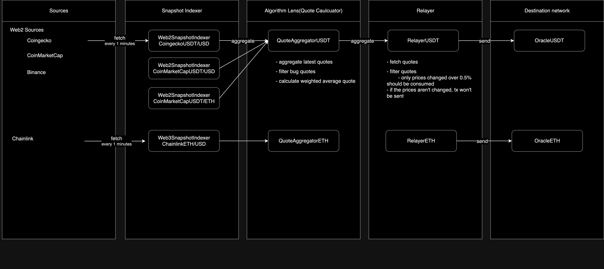

# price oracle

## Description

This is a sample of price oracle for [Chainsight](https://github.com/horizonx-tech/chainsight-cli).



## Example Usage

### Run your hardhat node

1. Run your hardhat node

in `./oracle`, run

```: bash
npx hardhat node
```

2. Deploy oracles

```: bash
yarn deploy
```

3. Export hardhat rpc url

Note: internet computer currently is unable to use http but https.

```: bash

```:bash
ngrok http 8545
```

### Run your chainsight

1. Deploy [chainsight-management-canisters](https://github.com/horizonx-tech/chainsight-management-canisters) on your local

2. Create canister ids

```: bash
csx build
cd artifacts
dfx canister create --all
```

3. Replace manifests

in `./components/chainlink_ethusd`,

``` diff
- id: 9fE46736679d2D9a65F0992F2272dE9f3c7fa6e0
+ id: xxxxxxx # MockChainlinkWrapper address in your hardhat local node

```

in `./components/coinmarketcap_usdtusd`,

``` diff
- X-CMC_PRO_API_KEY: YOUR_API_KEY
+ X-CMC_PRO_API_KEY: xxxx # your coinmarketcap api key
```

in `./components/relayer_ethusd`,
``` diff
- oracle_address: 0xe7f1725E7734CE288F8367e1Bb143E90bb3F0512
+ oracle_address: xxxxx # OracleETH address in your hardhat local node
 
- rpc_url: https://3c6d-240f-77-2850-3117-a1d5-f465-ee68-f75b.ngrok-free.app
+ rpc_url: https://xxxxx.ngrok-free.app # your ngrok url
```

in `./components/relayer_usdtusd`,
``` diff
- oracle_address: 0x5FbDB2315678afecb367f032d93F642f64180aa3
+ oracle_address: xxxxx # OracleUSDT address in your hardhat local node

- rpc_url: https://3c6d-240f-77-2850-3117-a1d5-f465-ee68-f75b.ngrok-free.app
+ rpc_url: https://xxxxx.ngrok-free.app # your ngrok url

# binance_usdtusd
- - br5f7-7uaaa-aaaaa-qaaca-cai
+ - xxxxx # your binance_usdtusd on your local dfx 
# coingecko_usdtusd
- - b77ix-eeaaa-aaaaa-qaada-cai
+ - xxxxx # your coingecko_usdtusd on your local dfx
# coinmarketcap_usdtusd
- - by6od-j4aaa-aaaaa-qaadq-cai
+ - xxxxx # your coinmarketcap_usdtusd on your local dfx
```


4. Deploy artifacts

```:bash

csx build
cd artifacts
dfx deploy
cd ..
csx exec

```
